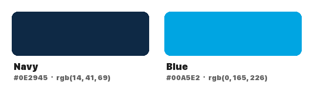

<p align="center">
  
</p>

# Provcast

A desktop application for preparing audio files for podcast publishing.

## Features

- Load and visualize audio files (MP3, WAV, AIFF, FLAC, OGG)
- Waveform editing with select, delete, undo/redo
- Dynamic range compression
- Noise reduction (RNNoise-based)
- Silence detection and trimming
- ID3 metadata editing with album art support
- MP3 export with CBR/VBR encoding options

## Tech Stack

- **Desktop:** Tauri v2 (Rust backend)
- **Frontend:** React + TypeScript + Vite
- **UI:** shadcn/ui + Tailwind CSS v4
- **Audio:** symphonia, rodio, nnnoiseless, mp3lame-encoder

## Prerequisites

- Node.js 22+ (via nvm: `nvm use --lts`)
- Rust toolchain (`brew install rust`)
- pnpm (`brew install pnpm`)

## Development

```bash
pnpm install
pnpm tauri dev
```

## Build

```bash
pnpm tauri build
```

## Branding

| Color | RGB | Hex | Usage |
|---|---|---|---|
| Navy | `rgb(14, 41, 69)` | `#0E2945` | Background |
| Blue | `rgb(0, 165, 226)` | `#00A5E2` | Foreground / Accent |



## Keyboard Shortcuts

| Shortcut | Action |
|---|---|
| Ctrl+O | Open audio file |
| Space | Play/Pause |
| Escape | Stop |
| Delete/Backspace | Delete selected region |
| Ctrl+Z | Undo |
| Ctrl+Shift+Z | Redo |
| Ctrl+= | Zoom in |
| Ctrl+- | Zoom out |
| Ctrl+E | Export MP3 |
