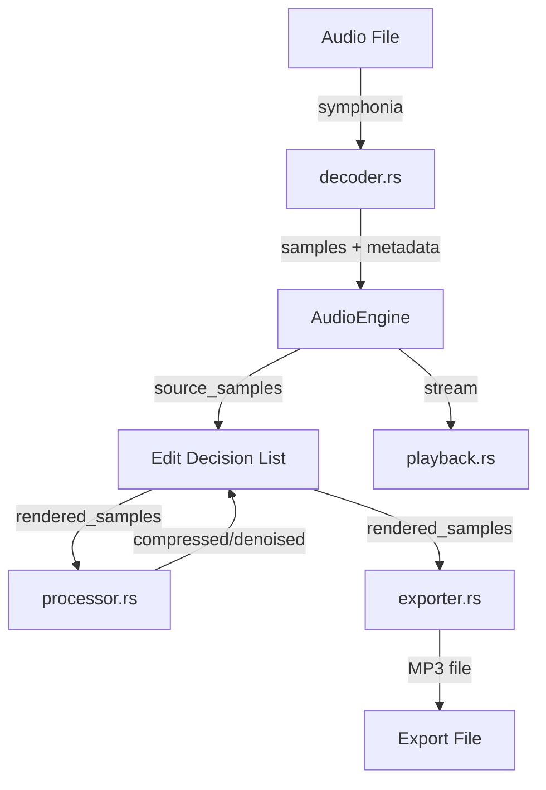

# Audio Engine

The core audio processing pipeline. All audio manipulation happens here — the frontend only handles visualization.

## Modules

| Module | Responsibility |
|--------|---------------|
| `mod.rs` | `AudioEngine` struct — holds source samples, EDL, playback state |
| `decoder.rs` | Decode audio files (MP3, WAV, FLAC, OGG, AIFF) via symphonia; generate peak data |
| `editor.rs` | Edit Decision List (EDL) — non-destructive edit stack with undo/redo |
| `processor.rs` | Dynamic range compression, noise reduction (nnnoiseless), silence detection |
| `playback.rs` | Real-time playback via rodio/cpal with seek and position tracking |
| `exporter.rs` | MP3 encoding via LAME with CBR/VBR support, normalization, metadata embedding |

## Non-Destructive Editing

Edits are stored as an ordered list of `EditOp` operations (Delete, Silence, ProcessedAudio). The original samples are never modified — `rendered_samples()` applies all edits on the fly. This enables full undo/redo by managing the edit stack.

## Threading

`AudioEngine` is wrapped in `parking_lot::Mutex` and stored as Tauri managed state. The playback position is emitted to the frontend via a background thread at ~30 Hz. Locks must be dropped before emitting events to avoid deadlocks.
