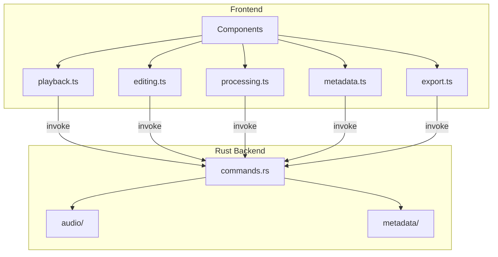

# Tauri IPC Wrappers

Thin async functions that bridge the React frontend to the Rust backend via Tauri's `invoke()`. Organized by domain:

## Modules

| Module | Commands | Side Effects |
|--------|----------|-------------|
| `playback.ts` | load_audio, play/pause/stop/seek | Updates store with file info |
| `editing.ts` | delete_region, undo/redo | Updates peaks, edit counts, deleted regions |
| `processing.ts` | compression, noise reduction, silence detection, preview | Updates peaks, processing flags |
| `metadata.ts` | read/write metadata, set album art | None (metadata stored in audio file) |
| `export.ts` | estimate size, export MP3, preview export | Emits progress events |

## Key Pattern

Most editing/processing commands return `UpdatedPeaks` (new peak data + duration + edit counts). The shared `applyUpdatedPeaks()` helper in `types.ts` applies these to the audio store.

## Constraints

- Audio sample data **never** crosses the IPC boundary — only metadata, peaks, and file paths
- Store updates happen on the frontend side after a successful `invoke()` call
- The `usePlaybackPositionSync` hook listens for `playback-position` events emitted by the Rust backend at ~30 Hz
