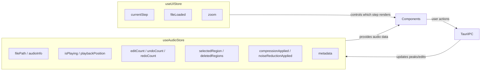

# Stores

Zustand stores managing all client-side state. The app uses two stores with distinct responsibilities:

## Store Responsibilities

**`useUIStore`** — Wizard navigation and display state. No audio data. Reset when the user loads a new file.

**`useAudioStore`** — All audio-related state. Wrapped with [zundo](https://github.com/charkour/zundo) for temporal undo/redo. The `setFile()` action resets editing state (edits, regions, processing flags) but preserves metadata.

## Invariants

- `useUIStore.fileLoaded` should always reflect whether `useAudioStore.filePath` is non-null
- `deletedRegions` tracks frontend-visible deletion boundaries (the Rust EDL doesn't expose these back)
- `previewMode` is cleared whenever an effect is permanently applied
